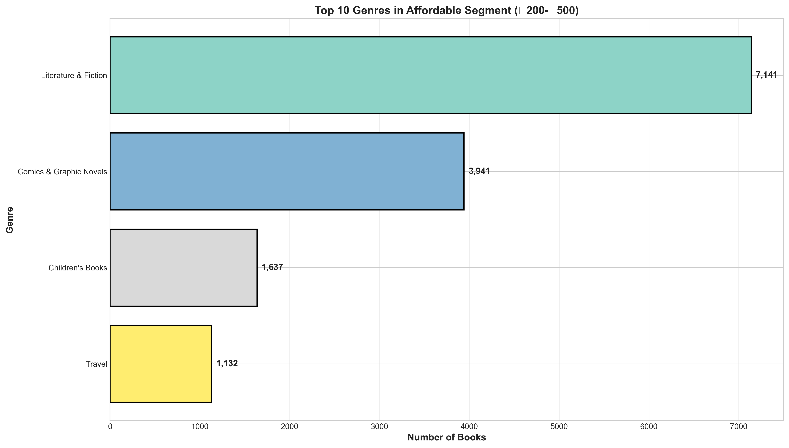
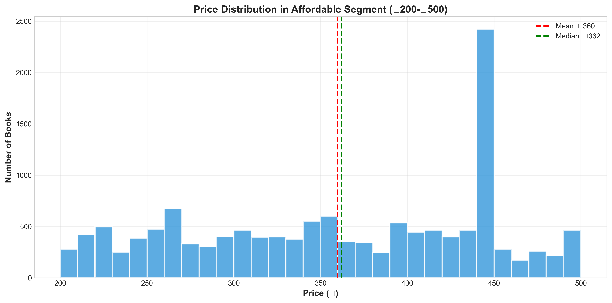
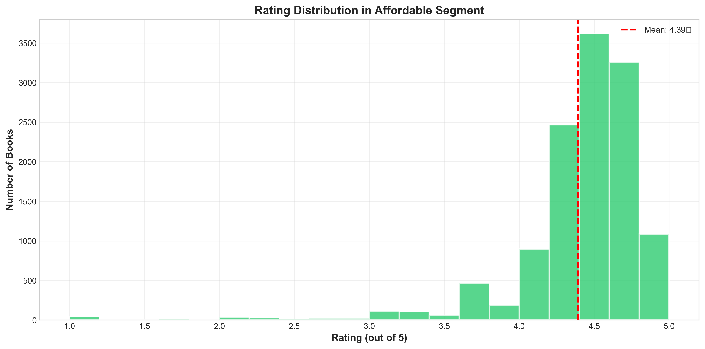
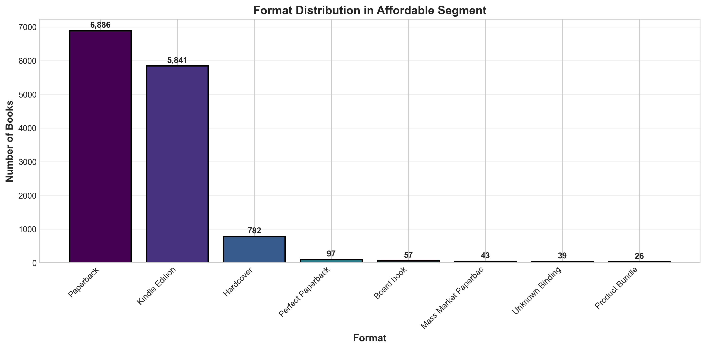
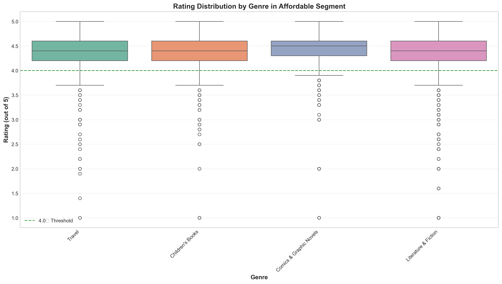
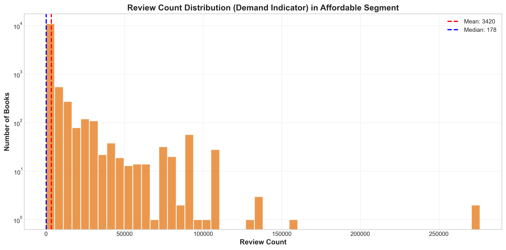
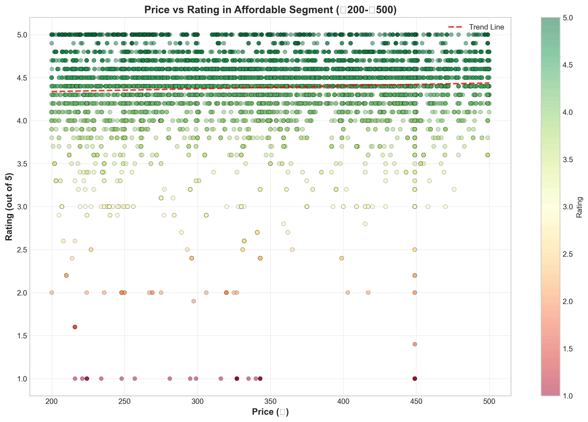

# Affordable Segment Analysis (₹200-₹500)

**Analysis Date:** 2025-12-04 14:33:39

**Total Books in Segment:** 13,851

**Market Share:** 44.6% of total market

---

## Executive Summary

- **Average Price:** ₹359.77
- **Median Price:** ₹362.00
- **Average Rating:** 4.39★
- **Quality Standard:** 91.3% have 4.0+★
- **Top Genre:** Literature & Fiction

---

## 1. Genre Patterns

### 1.1 Top Genres by Count

| Rank | Genre | Count | % Share | Avg Price | Avg Rating |
|------|-------|-------|---------|-----------|------------|
| 1 | Literature & Fiction | 7,141 | 51.6% | ₹371.46 | 4.36★ |
| 2 | Comics & Graphic Novels | 3,941 | 28.5% | ₹348.24 | 4.47★ |
| 3 | Children's Books | 1,637 | 11.8% | ₹329.02 | 4.38★ |
| 4 | Travel | 1,132 | 8.2% | ₹370.59 | 4.33★ |

### 1.2 Sub-Genre Patterns

#### Literature & Fiction

| Sub-Genre | Count | % of Genre | Avg Price | Avg Rating |
|-----------|-------|------------|-----------|------------|
| Genre Fiction | 1,175 | 16.5% | ₹364.64 | 4.36★ |
| Romantic Fiction | 650 | 9.1% | ₹371.22 | 4.38★ |
| Mystery & Thriller Fiction | 648 | 9.1% | ₹368.71 | 4.38★ |
| Historical Fiction | 647 | 9.1% | ₹368.25 | 4.37★ |
| Science Fiction | 621 | 8.7% | ₹368.03 | 4.36★ |
| Fantasy Fiction | 617 | 8.6% | ₹368.32 | 4.38★ |
| Action & Adventure Fiction | 616 | 8.6% | ₹368.60 | 4.37★ |
| Contemporary Fiction | 610 | 8.5% | ₹405.36 | 4.26★ |
| Horror Fiction | 608 | 8.5% | ₹369.98 | 4.39★ |
| Literary Fiction | 478 | 6.7% | ₹371.81 | 4.29★ |

#### Comics & Graphic Novels

| Sub-Genre | Count | % of Genre | Avg Price | Avg Rating |
|-----------|-------|------------|-----------|------------|
| Graphic Novels | 2,076 | 52.7% | ₹356.49 | 4.47★ |
| Comic Books | 959 | 24.3% | ₹337.04 | 4.49★ |
| Superhero Comics | 259 | 6.6% | ₹348.15 | 4.46★ |
| Horror Comics | 204 | 5.2% | ₹330.74 | 4.51★ |
| Fantasy Comics | 204 | 5.2% | ₹336.41 | 4.48★ |
| Science Fiction Comics | 177 | 4.5% | ₹351.92 | 4.44★ |
| Manga | 62 | 1.6% | ₹331.41 | 4.43★ |

#### Children's Books

| Sub-Genre | Count | % of Genre | Avg Price | Avg Rating |
|-----------|-------|------------|-----------|------------|
| Fiction by Format | 868 | 53.0% | ₹333.08 | 4.38★ |
| Fiction Collections | 438 | 26.8% | ₹321.26 | 4.34★ |
| Children's Reference | 145 | 8.9% | ₹321.01 | 4.40★ |
| Children's Non-Fiction | 107 | 6.5% | ₹342.50 | 4.44★ |
| Children's Fiction | 79 | 4.8% | ₹323.85 | 4.41★ |

#### Travel

| Sub-Genre | Count | % of Genre | Avg Price | Avg Rating |
|-----------|-------|------------|-----------|------------|
| Travel Guides by Region | 645 | 57.0% | ₹381.74 | 4.30★ |
| Travel Guides | 426 | 37.6% | ₹356.88 | 4.35★ |
| Travel Writing | 61 | 5.4% | ₹348.31 | 4.39★ |

---

## 2. Demand Patterns

### 2.1 Rating Patterns (Quality Indicator)

- **Mean Rating:** 4.39★
- **Median Rating:** 4.40★
- **Books with 4.0+★:** 11,331 (91.3%)
- **Books with 4.5+★:** 6,138 (49.5%)

### 2.2 Review Count Patterns (Demand Indicator)

- **Mean Reviews:** 3420
- **Median Reviews:** 178
- **Books with 100+ reviews:** 7,034 (56.7%)
- **Books with 500+ reviews:** 4,673 (37.7%)

### 2.3 Format Preferences

| Format | Count | % Share | Avg Price | Avg Rating |
|--------|-------|---------|-----------|------------|
| Paperback | 6,886 | 49.7% | ₹346.79 | 4.46★ |
| Kindle Edition | 5,841 | 42.2% | ₹378.05 | 4.29★ |
| Hardcover | 782 | 5.6% | ₹352.26 | 4.50★ |
| Perfect Paperback | 97 | 0.7% | ₹306.10 | 4.01★ |
| Board book | 57 | 0.4% | ₹306.02 | 4.67★ |
| Mass Market Paperback | 43 | 0.3% | ₹347.75 | 4.50★ |
| Unknown Binding | 39 | 0.3% | ₹303.72 | 4.29★ |
| Product Bundle | 26 | 0.2% | ₹342.23 | 4.51★ |
| Workbook | 25 | 0.2% | ₹356.36 | 4.38★ |
| Map | 15 | 0.1% | ₹384.60 | 4.35★ |

---

## 3. Book Patterns

### 3.1 Top Authors

| Rank | Author | Books | Avg Price | Avg Rating | Avg Reviews |
|------|--------|-------|-----------|------------|-------------|
| 1 | KENICHI | 135 | ₹222.00 | 4.30★ | 19 |
| 2 | Kenna King | 121 | ₹449.00 | 4.26★ | 4151 |
| 3 | Saika | 98 | ₹449.00 | 4.20★ | 10 |
| 4 | Oswal Publishers | 88 | ₹332.59 | 4.38★ | 40 |
| 5 | Tahereh Mafi | 82 | ₹319.02 | 4.52★ | 10487 |
| 6 | miyukikaoru | 82 | ₹449.00 | 3.80★ | 14 |
| 7 | James Dashner | 65 | ₹308.52 | 4.46★ | 17989 |
| 8 | Ruth Stilling | 64 | ₹428.25 | 4.20★ | 2936 |
| 9 | Michael Cox | 58 | ₹389.98 | 4.60★ | 1842 |
| 10 | Michael Phelps | 57 | ₹343.01 | 4.45★ | 929 |
| 11 | Nimish Dubey | 53 | ₹263.90 | 5.00★ | 5 |
| 12 | Monica Murphy | 51 | ₹420.80 | 4.29★ | 3399 |
| 13 | Jennifer Lynn Barnes | 50 | ₹362.15 | 4.46★ | 9889 |
| 14 | Wonder House Books | 50 | ₹345.80 | 4.49★ | 877 |
| 15 | Matt Fitzgerald | 50 | ₹467.35 | 4.46★ | 1926 |
| 16 | Alice Oseman | 49 | ₹357.86 | 4.67★ | 10276 |
| 17 | Hailey Rodger | 48 | ₹323.33 | 4.30★ | 725 |
| 18 | VH Nicolson | 48 | ₹400.33 | 4.47★ | 961 |
| 19 | Brittanee Nicole | 48 | ₹442.33 | 4.47★ | 4819 |
| 20 | Christopher McDougall | 46 | ₹399.04 | 4.60★ | 12098 |

### 3.2 High-Demand Books (500+ Reviews, 4.5+★)

| Title | Author | Price | Rating | Reviews |
|-------|--------|-------|--------|---------|
| A Court of Mist and Fury: The second book in the GLOBALLY BE | Sarah J. Maas | ₹335 | 4.7★ | 276250 |
| A Court of Mist and Fury: The second book in the GLOBALLY BE | Sarah J. Maas | ₹335 | 4.7★ | 276249 |
| The Fault in Our Stars | John Green | ₹274 | 4.5★ | 156606 |
| 1984 (Deluxe Hardbound Edition) | George Orwell | ₹439 | 4.5★ | 135354 |
| 1984 (Deluxe Hardbound Edition) | George Orwell | ₹439 | 4.5★ | 135354 |
| 1984 (Deluxe Hardbound Edition) | George Orwell | ₹439 | 4.5★ | 135354 |
| The Ballad of Songbirds and Snakes (A Hunger Games Novel) (T | Suzanne Collins | ₹364 | 4.6★ | 100578 |
| Zodiac Academy 3: The Reckoning | Caroline Peckham | ₹449 | 4.6★ | 96520 |
| The Hunger Games | Suzanne Collins | ₹499 | 4.6★ | 91081 |
| The Hunger Games | Suzanne Collins | ₹499 | 4.6★ | 91081 |
| The Hunger Games (Hunger Games Trilogy, Book 1) | Suzanne Collins | ₹276 | 4.6★ | 91081 |
| The Hunger Games | Suzanne Collins | ₹499 | 4.6★ | 91081 |
| The Hunger Games | Suzanne Collins | ₹499 | 4.6★ | 91081 |
| The Hunger Games | Suzanne Collins | ₹499 | 4.6★ | 91081 |
| The Hunger Games | Suzanne Collins | ₹499 | 4.6★ | 91081 |
| The Hunger Games | Suzanne Collins | ₹499 | 4.6★ | 91081 |
| The Hunger Games | Suzanne Collins | ₹499 | 4.6★ | 91081 |
| The Hunger Games | Suzanne Collins | ₹499 | 4.6★ | 91081 |
| The Hunger Games (Hunger Games Trilogy, Book 1) | Suzanne Collins | ₹276 | 4.6★ | 91081 |
| The Hunger Games | Suzanne Collins | ₹499 | 4.6★ | 91081 |

---

## 4. Price Sub-Segments Within Affordable Range

| Price Range | Count | % Share | Avg Rating | Avg Reviews | Top Genre |
|-------------|-------|---------|------------|-------------|-----------|
| ₹200-₹300 | 4,014 | 29.0% | 4.36★ | 1580 | Literature & Fiction |
| ₹300-₹400 | 4,255 | 30.7% | 4.39★ | 5369 | Literature & Fiction |
| ₹400-₹500 | 5,582 | 40.3% | 4.41★ | 3197 | Literature & Fiction |

---

## 5. Key Insights & Patterns

### 5.1 Genre Patterns

- **Dominant Genre:** Literature & Fiction represents 51.6% of affordable segment
- **Genre Diversity:** 4 unique genres in affordable segment
- **Top 3 Genres:** Literature & Fiction, Comics & Graphic Novels, Children's Books account for 91.8% of segment

### 5.2 Demand Patterns

- **Quality Standard:** 91.3% maintain 4.0+★ rating
- **High Demand Books:** 2,410 books have 500+ reviews and 4.5+★ rating
- **Review Activity:** Average of 3420 reviews per book indicates strong customer engagement

### 5.3 Format Preferences

- **Preferred Format:** Paperback dominates with 49.7% market share

### 5.4 Price Positioning

- **Price Concentration:** Most books cluster around ₹362 (median)
- **Price Range:** ₹200 - ₹500

---

## 6. Visualizations

The following visualizations are available:

### Genre Distribution

*Figure: Genre Distribution*

### Price Distribution

*Figure: Price Distribution*

### Rating Distribution

*Figure: Rating Distribution*

### Format Distribution

*Figure: Format Distribution*

### Rating by Genre

*Figure: Rating by Genre*

### Review Count Distribution

*Figure: Review Count Distribution*

### Price vs Rating

*Figure: Price vs Rating*

---
